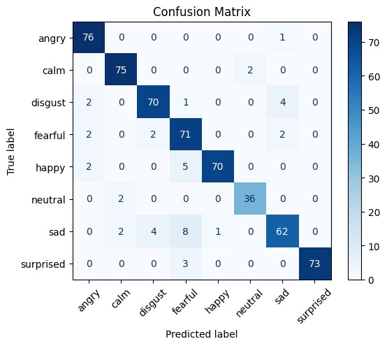

# Emotion Detection from Voice

This project uses **Convolutional Neural Networks (CNNs)** to detect emotions from voice recordings. The dataset is preprocessed to extract **MFCC (Mel Frequency Cepstral Coefficients)** features, which are then used to train a deep learning model to classify emotions.

## Features
- **Emotion Detection**: Classifies emotions such as happy, sad, angry, calm, etc.
- **Visualization**: Displays MFCC curves and confusion matrices for better understanding.
- **Preprocessing**: Standardizes audio features for consistent input to the model.

---

## Results

### Model Performance
- **Test Accuracy**: ~92%
- **Confusion Matrix**:
  

- **Accuracy and Loss Graphs**:
  - **Accuracy**:
    
  - **Loss**:
    


---

## Installation

### Prerequisites
- Python 3.8 or higher
- Virtual environment (recommended)

### Clone the Repository
```bash
git clone https://github.com/your-username/emotion-detection-from-voice.git
cd emotion-detection-from-voice

Set Up Virtual Environment

python -m venv .venv
[activate](http://_vscodecontentref_/1)  # On Windows
# source .venv/bin/activate  # On Linux/Mac

Install Dependencies
pip install -r requirements.txt


Usage
1. Preprocess the Dataset
Place your .wav files in the data/ directory. The dataset should follow the RAVDESS naming convention.

2. Train the Model
Run the main.ipynb notebook to preprocess the data, train the model, and evaluate its performance.

3. Test with New Audio
Use the following code snippet to test the model with a new .wav file:

y_new, sr_new = librosa.load("path_to_audio.wav", sr=sr)
mfcc_new = librosa.feature.mfcc(y=y_new, sr=sr_new, n_mfcc=40)
mfcc_new_std = standarize([mfcc_new], max_len=300)
mfcc_new_std = mfcc_new_std.reshape(1, 40, 300, 1)
pred = model.predict(mfcc_new_std)
pred_label = le.inverse_transform([np.argmax(pred, axis=1)[0]])[0]
print("Predicted emotion:", pred_label)


Project Structure
emotionDetectionFromVoice/
│
├── data/                     # Dataset folder
├── [main.ipynb](http://_vscodecontentref_/2)                # Main notebook for training and evaluation
├── mfcc_plot.ipynb           # Notebook for MFCC visualization
├── emotion_model_92.h5       # Trained model
├── requirements.txt          # Python dependencies
├── [README.md](http://_vscodecontentref_/3)                 # Project documentation
└── .gitignore                # Git ignore file

Dependencies
- librosa
- numpy
- matplotlib
- keras
- scikit-learn
- tensorflow
- tqdm
Install all dependencies using:
'''batch 
pip install -r requirements.txt


References
-  RAVDESS Dataset
-  Librosa Documentation


License
This project is licensed under the MIT License. See the LICENSE file for details.